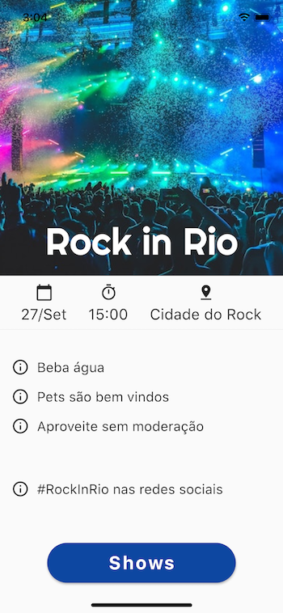
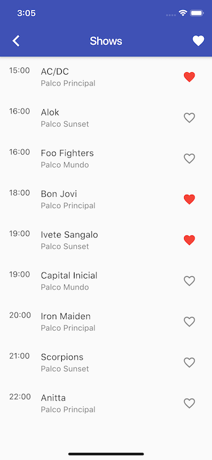
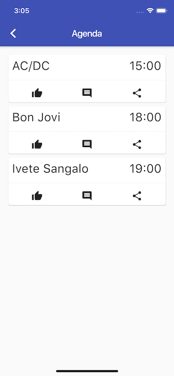

# Rock In Rio

Neste aplicativo, você irá aprender:

* Anatomia de aplicativos em Flutter.
* Compor widgets para montar layouts.
* Criar seu próprio widget customizado.
* Importar fontes e imagens.
* Navegação.

Existem vários palcos, com diversas bandas e os mais variados horários de apresentação. Seria bacana um aplicativo onde pudessemos ter todas essas informações e ainda favoritar as atrações de nosso interesse para não perdermos a oportunidade de acompanhar nosso show favorito. Pois bem, esta é a proposta deste aplicativo:

* Informações de todos os shows
* Agenda

Agora que já sabemos dos requisitos, podemos começar a planejar nossa interface:

