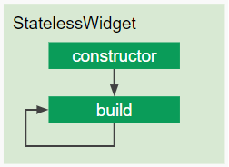
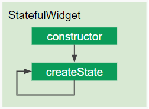
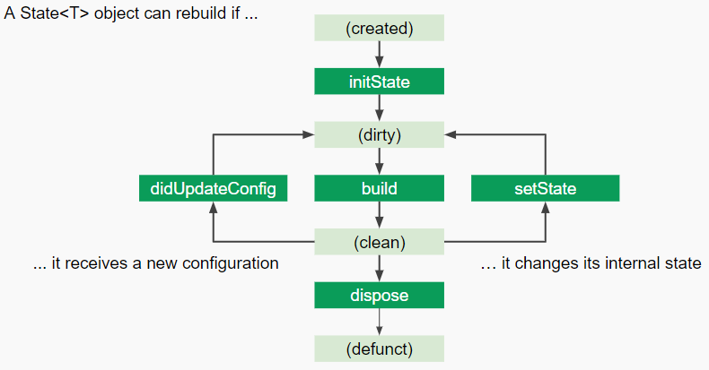

# Ciclo de vida dos widgets

Anteriormente vimos os 2 tipos de widgets e agora vamos entender o ciclo de vida de cada um deles.

## [Stateless](https://api.flutter.dev/flutter/widgets/StatelessWidget-class.html)

Por ser mais simples e não possui estado, não dá trabalho nenhum ao framework. Apenas é construído e pronto, permanece imutável.

Quando criamos um Stateless widget, o Flutter executa o seu construtor e em seguida o método [build()](https://api.flutter.dev/flutter/widgets/StatelessWidget/build.html).



```dart
class MeuWidgetImutavel extends StatelessWidget {

  @override
  Widget build(BuildContext context) {
    return const Text('Eu não terei meu estado alterado');
  }
}
```

A anatomia de um **Stateless** widget é esta: basicamente precisamos sobrescrever o método [build()](https://api.flutter.dev/flutter/widgets/StatelessWidget/build.html) para indicarmos ao Flutter como deve ser o nosso `MeuWidgetImutavel` , (neste caso apenas um texto).


Não se preocupe em entender o construtor neste momento, teremos uma seção apenas para detalhá-lo, quando estudarmos [Keys](https://flutter.dev/docs/development/ui/widgets-intro#keys).


## [Stateful](https://api.flutter.dev/flutter/widgets/StatefulWidget-class.html)

Inicialmente, parece ser tão simples quando o [Stateless](https://api.flutter.dev/flutter/widgets/StatelessWidget-class.html) widget, quando criamos nosso widget, o Flutter chama o seu construtor e em seguida o método [createState()](https://api.flutter.dev/flutter/widgets/StatefulWidget/createState.html).



```dart
class MeuWidgetImutavel extends StatefulWidget {

  @override
  _MeuWidgetImutavelState createState() => _MeuWidgetImutavelState();
}

class _MeuWidgetImutavelState extends State<MeuWidgetImutavel> {
  @override
  Widget build(BuildContext context) {
    return const Text('Eu terei meu estado alterado');
  }
}
```

* O uso do "\_" torna o widget privado para o escopo da biblioteca em que ele se encontra;
* O uso de "=>" indica que este método executa apenas 1 função.

Mas não se engane, pois a diferença não é apenas no nome dos métodos. Lembre-se que ao criar um objeto do tipo [State](https://api.flutter.dev/flutter/widgets/State-class.html), um [Stateful](https://api.flutter.dev/flutter/widgets/StatefulWidget-class.html) widget ganha poderes mutáveis?! Então, é dentro dele que a mágica acontece.

Nosso `MeuWidgetImutavel` ao ser construído pelo framework, executa o método `createState()` (linha 5) e este por sua vez, executa apenas 1 função, que é instanciar `_MeuWidgetImutavelState`. Ele é um filho de [State](https://api.flutter.dev/flutter/widgets/State-class.html), logo, herda algumas características e comportamentos (linha 8).

Vamos analisar com calma o ciclo de vida de um objeto [State](https://api.flutter.dev/flutter/widgets/State-class.html).



Pode parecer complicado, porém é mais simples do que você imagina. Todo este ciclo é necessário para que o método [setState()](https://api.flutter.dev/flutter/widgets/State/setState.html) cumpra o seu papel, que é notificar nosso widget que ele precisa ser reconstruído (ter seu método [build()](https://api.flutter.dev/flutter/widgets/State/build.html) executado novamente).


Abordaremos apenas os métodos nas caixas em verde escuro. As caixas em verde claro tratam de estados de um [State](https://api.flutter.dev/flutter/widgets/State-class.html). Não é o nosso foco **neste** momento. Apenas entender o ciclo de vida dele já é suficiente.


[initState](https://api.flutter.dev/flutter/widgets/State/initState.html): Chamado **apenas 1 única vez**, na criação no widget**.** Quando o widget é **inserido** na _widget tree_.

[build](https://api.flutter.dev/flutter/widgets/State/build.html): Chamado em diferentes situações. Sempre que o widget precisar ser reconstruído ou após o [initState()](https://api.flutter.dev/flutter/widgets/State/initState.html) ou após a função[ setState()](https://api.flutter.dev/flutter/widgets/State/setState.html) e até mesmo quando o widget for [removido](https://api.flutter.dev/flutter/widgets/State/deactivate.html) da widget tree para ser inserido em outro ponto (isto ficará mais claro quando construirmos nosso primeiro app).

[dispose](https://api.flutter.dev/flutter/widgets/State/dispose.html): Chamado quando o widget for **removido** da widget tree **permanentemente**.

[setState](https://api.flutter.dev/flutter/widgets/State/setState.html): Responsável por notificar nosso widget que o estado interno foi alterado. Por exemplo, ao concluir uma requisição HTTP, queremos exibir estas informações na tela. Para isso, preenchemos nossa tela com as informações recebidas e invocamos a função [setState()](https://api.flutter.dev/flutter/widgets/State/setState.html).

[didUpdateConfig](https://api.flutter.dev/flutter/widgets/State/didUpdateWidget.html): Sempre que o seu widget sofrer alterações, este método é chamado e executado antes do [build()](https://api.flutter.dev/flutter/widgets/State/build.html). Ou seja, sempre que chamar o [setState()](https://api.flutter.dev/flutter/widgets/State/setState.html), este método é executado. Pode ser útil ao lidar com animações e/ou quando precisar ter acesso ao estado antigo do widget.


_O nome deste método mudou para_ **didUpdateWidget** _e o diagrama oficial ainda está desatualizado._


Como vimos, cada um dos métodos acima são executados em momentos diferentes. Cada um deles possui responsabilidades e comportamentos diferentes, logo, devemos utilizá-los da maneira correta.


### Ficará mais simples compreender a real função de cada um destes métodos, o que fazer em cada um deles, quando utilizar um ou outro à medida em que formos progredindo no aprendizado e tivermos novas necessidades. Não se preocupe :)

