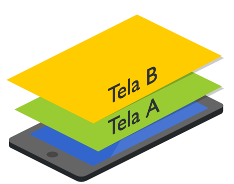

# Navegação

A navegação no Flutter utiliza o conceito de "[pilha](https://pt.wikipedia.org/wiki/Pilha\_\(inform%C3%A1tica\))" (stack). Ou seja, se estamos na **Tela A** e vamos para a **Tela B**, internamente, estamos colocando a **Tela B** acima da **Tela A**. Assim, a **Tela B** está no "topo" da pilha. Se desejarmos voltar à **Tela A**, basta remover a **Tela B** do topo da pilha.


A última tela que entra, é a primeira tela que sai.




Para manipular a "pilha" de telas no Flutter, utilizamos o widget [Navigator](https://api.flutter.dev/flutter/widgets/Navigator-class.html). Com o princípio de  **"o último que entra é o primeiro que sai"**, temos as operações de **push** e **pop**, para adicionarmos e removermos telas da nossa "pilha" de navegação.


****[**Push**](https://api.flutter.dev/flutter/widgets/Navigator/push.html): Estamos "empurrando" uma nova tela ao topo da pilha.

****[**Pop**](https://api.flutter.dev/flutter/widgets/Navigator/pop.html): A tela que está no topo da pilha, é removida.


Agora já sabemos os conceitos básicos de navegação no Flutter, vamos ver no código, como eles são implementados:


A transição entre telas é diferente no iOS e no Android. Sabendo disso, o Flutter se adapta "automagicamente" à cada plataforma e proporciona o efeito e transição padrão em cada uma delas.



**Push:** Neste exemplo, estamos navegando para a **DetailPage**.

```dart
ElevatedButton(
  onPressed: () {
    Navigator.push(
      context,
      MaterialPageRoute(builder: (context) => DetailPage()),
    );
  },
)
```

Mesmo utilizando um widget **MaterialPageRoute** (que segue as especificações do Material Desing e é utilizada no Android), se este código for executado em um dispositivo iOS, o efeito da transição será aquele característico da plataforma.

**Pop:** Quando estivermos em **DetailPage** e quisermos voltar à página anterior, basta chamar o método **pop()**.

```dart
ElevatedButton(
  onPressed: () {
    Navigator.pop(context);
}
```

Simples, certo? Ao navegar para a próxima tela, utilizamos o `push` e para voltar, o `pop`.

Exemplo de código completo no [DartPad](https://dartpad.dev/?id=ce72becd4fbd8a40dbeb819c31321c3e).
