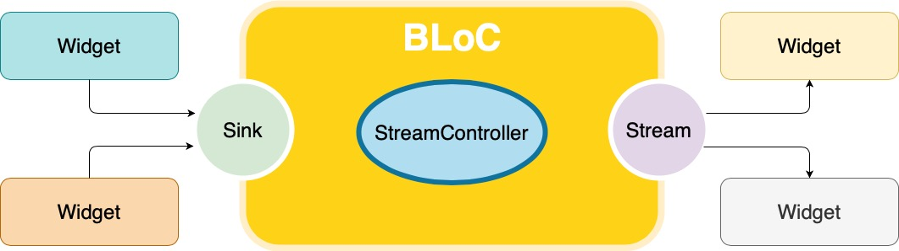

# BLoC

**B**usiness **L**ogic **o**f **C**omponent \(ou BLoC para os íntimos\) é um padrão apresentado pelo Google na [DartConf 2018](https://www.youtube.com/watch?v=PLHln7wHgPE), sobre o compartilhamento de código entre o Flutter e o [AngularDart](https://angulardart.dev).

Usando Flutter para a versão mobile e AngularDart para a versão web, como podemos gerenciar o estado do aplicativo, com menos esforço possível? Utilizando uma solução que esteja disponível para as duas plataformas, que neste caso são [Streams](https://dart.dev/tutorials/language/streams)


Stream é uma sequência de **eventos** assíncronos.


As opções apresentadas anteriormente utilizam recursos internos do Flutter e que não podemos utilizar fora do framework.

Streams são um recurso nativo da linguagem Dart, ou seja, podemos utilizá-las independente da plataforma. Sendo assim, nossa solução de gerenciamento de estado é puramente código Dart, podendo ser utilizada com Flutter e AngularDart.

Por ser um componente lógico, o BLoC não se preocupa com a interface e nem com a sua camada de dados ou API. Ele entende "apenas" de eventos. Os widgets emitem eventos e outros widgets podem respondem à estes eventos. Com este padrão é possível separar a lógica de negócio e a interface.

Com a imagem abaixo, ficará mais fácil de entender:



O coração de um BLoC é a [StreamController](https://api.dart.dev/stable/2.4.1/dart-async/StreamController-class.html).

Com ela, temos acesso às propriedades [sink](https://api.dart.dev/stable/2.4.1/dart-async/StreamController/sink.html) \(entrada\) e a [stream](https://api.dart.dev/stable/2.4.1/dart-async/StreamController/stream.html) \(saída\).

Com estes três componentes temos tudo o que é necessário para implementar o padrão BLoC.


Eventos são quaisquer ações que alteram o estado da nossa aplicação. Seja a chamda para uma API, o usuário fazendo login e até mesmo o incremento de um contador.


1. Eventos são emitidos para o nosso BLoC, via sink;
2. O BLoC recebe o evento e aplica alguma lógica de negócio;
3. A saída do evento é colocada na stream;
4. Todos que estejam "ouvindo" a stream do nosso BLoC são notificados de que há um novo valor para ela.


Mesmo citando widgets \(que são componentes do Flutter\), os eventos poderiam ser disparados por componentes do AngularDart. Lembre-se que o BLoC foi apresentado para facilitar o compartilhamento de código entre a web e mobile.


## BLoC no Flutter

Agora já sabemos sobre o padrão e iremos descobrir como implementá-los no nosso aplicativo. Para isso, o framework nos fornece o widget [StreamBuilder](https://api.flutter.dev/flutter/widgets/StreamBuilder-class.html).

Falaremos mais tarde, antes, precisamos implementar nosso BLoC.

```dart
class MeuBloc {
  int _total = 0;
  int get total => _total;

  final _blocController = StreamController<int>();

  Stream<int> get minhaStream => _blocController.stream;

  void incrementar() {
    _total++;
    _blocController.sink.add(total);
  }

  fecharStream() {
    _blocController.close();
  }
}
```

1. Temos uma **`total`** propriedade do tipo int \(privada\);
2. Criamos um método **get** para acessá-la;
3. Declaramos nossa **StreamController;**
4. Criamos um método **get** para acessar a stream da nossa StreamController;
5. Criamos o méotodo **`incrementar()`** para incrementar o valor de `total` e com o método `add()` da propriedade `sink`, adicionamos o valor já incrementado à nossa StreamController;
6. Criamos o méotodo **`fecharStream()`** para fechar nosso `_blocController`.


O não fechamento **StreamController** implica na utilização de memória de forma desnecessária, isso pode ocasionar perda de desempenho e falhas na aplicação.



Já temos nosso componente lógico pronto.


Portanto, já podemos utilizá-lo para construir nossa interface. Chegou a hora de conhecer melhor o widget que irá ouvir a **stream** da nossa StreamController e "reagir" à qualquer novo evento emitido pela stream.

### StreamBuilder

Este widget fica "ouvindo" uma stream e sempre que há um novo evento, ele é reconstruído \(o método **builder** é executado novamente\).

```dart
StreamBuilder<int>(
  stream: minhaStream, //stream do tipo int
  builder: (BuildContext context, AsyncSnapshot<int> snapshot) {
    if (snapshot.hasError) {
        return Text('Erro com a stream');
    } else {
        return Text('$snapshot.data');    
    }
  },
)
```

Vamos analisar:

1. Declaramos nosso widget **StreamBuilder** \(com o tipo int\);
2. Na propriedade stream, indicamos qual **stream** queremos "ouvir";
3. Implementamos a função **builder**. Ela recebe como parâmetro o [BuildContext](https://api.flutter.dev/flutter/widgets/BuildContext-class.html) e um [AsyncSnapshot](https://api.flutter.dev/flutter/widgets/AsyncSnapshot-class.html) \(não se preocupe com isso agora\).
4. Caso nossa stream contenha algum erro, retornamos um texto informativo;
5. Se não houver nenhum problemas, exibimos o dado do snapshot \(.data\) que é o último valor recebido pela stream;
6. Para que nosso `_blocController` seja encerrado de maneira correta, precisamos sobrescrever o método `dispose` \(\_HomePageState\);

Um exemplo completo do aplicativo Contador utilizando o padrão BLoC:

```dart
import 'package:flutter/material.dart';
import 'dart:async';

void main() => runApp(BlocApp());

class BlocApp extends StatelessWidget {
  @override
  Widget build(BuildContext context) {
    return MaterialApp(
      title: 'Flutter para Iniciantes - BLoC',
      debugShowCheckedModeBanner: false,
      home: HomePage(),
    );
  }
}

class HomePage extends StatefulWidget {
  @override
  _HomePageState createState() => _HomePageState();
}

class _HomePageState extends State<HomePage> {
  MeuBloc bloc = MeuBloc();

  @override
  Widget build(BuildContext context) {
    return Scaffold(
      appBar: AppBar(
        title: Text('Flutter para Iniciantes - BLoC'),
      ),
      body: Center(
        child: Column(
          mainAxisAlignment: MainAxisAlignment.center,
          children: <Widget>[
            StreamBuilder<int>(
                stream: bloc.minhaStream,
                initialData: 0,
                builder: (context, snapshot) {
                  if (snapshot.hasError) {
                    return Text('Há um erro na Stream');
                  } else {
                    return Text(
                      '${snapshot.data}',
                      style: Theme.of(context).textTheme.headline4,
                    );
                  }
                }),
          ],
        ),
      ),
      floatingActionButton: FloatingActionButton(
        onPressed: bloc.incrementar,
        tooltip: 'Increment',
        child: Icon(Icons.add),
      ),
    );
  }
  @override
  void dispose() {
    bloc.fecharStream();
    super.dispose();
  }
}

class MeuBloc {
  int _total = 0;

  int get total => _total;

  // 1
  final _blocController = StreamController<int>();

  // 2
  Stream<int> get minhaStream => _blocController.stream;

  // 3
  void incrementar() {
    _total++;
    _blocController.sink.add(total);
  }

  fecharStream() {
    _blocController.close();
  }
}
```

Brinque com ele também no [DartPad](https://dartpad.dev/b6409e10de32b280b8938aa75364fa7b).

