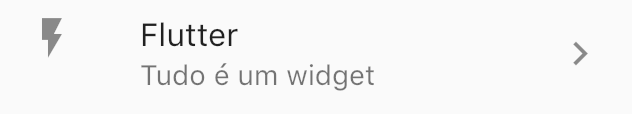
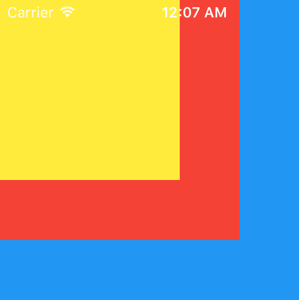

# Layout

Antes de constrruirmos uma tela, com botões, inputs, imagens, precisamos definir como será o seu layout, como por exemplo, se os itens serão posicionados na vertical ou horizontal. Na parte superior, teremos um slide com fotos fixo e abaixo uma lista de itens ? São definições estruturais básicas e que devem ser feitas antes da customização \(não se começa construindo uma casa, sem antes ter a planta em mãos\).

Com Flutter é a mesma coisa: Definimos o layout da nossa tela e então vamos adicionando widgets de interface.

Imagine que você precisa construir o widget abaixo:


Podemos concluir que:

* Os widgets devem ser exibidos horizontalmente;
* O ícone e o texto devem ser exibidos verticalmente.

Sendo um pouco mais _flutterista_: 

* Deve haver uma [Row](https://api.flutter.dev/flutter/widgets/Row-class.html) \(linha\) para que os widgets sejam exibidos na horizontal;
* A Row será composta por 3 itens do tipo [Column](https://api.flutter.dev/flutter/widgets/Column-class.html) \(coluna\), para que os widgets sejam exibidos na vertical;
* Os widgets dentro da [Column](https://api.flutter.dev/flutter/widgets/Column-class.html) devem ser: [Icon](https://api.flutter.dev/flutter/widgets/Icon-class.html) e [Text](https://api.flutter.dev/flutter/widgets/Text-class.html) . 

Então, temos: 



Linhas e colunas farão parte de vários layouts que você irá construir, acostume-se. 


Vamos construir o layout:

A coluna \([Column](https://api.flutter.dev/flutter/widgets/Column-class.html)\) que contém o ícone \([Icon](https://api.flutter.dev/flutter/widgets/Icon-class.html)\) e o texto \([Text](https://api.flutter.dev/flutter/dart-html/Text-class.html)\). 

```dart
Column(
  children: [Icon(Icons.call), Text('Call')],
)
```


Precisaremos de 3 widgets \(a estrutura é a mesma, mudando apenas o ícone e o texto\).

Eles serão exibidos em linha horizontal \([Row](https://api.flutter.dev/flutter/widgets/Row-class.html)\):

```dart
Row(
  mainAxisAlignment: MainAxisAlignment.spaceEvenly,
  children: [
    Column(
      children: <Widget>[Icon(Icons.call), Text('Call')],
    ),
    Column(
      children: <Widget>[Icon(Icons.directions), Text('Route')],
    ),
    Column(
      children: <Widget>[Icon(Icons.share), Text('Share')],
    ),
  ],
)
```

Pronto! Combinando widgets, montamos um outro widget que pode ser utilizado em qualquer lugar do nosso aplicativo.



Algumas vezes, nossa tela será composta por uma lista \(como a sua agenda de contatos, uma lista com vários itens\). Para isso, utilizamos o widget [ListView](https://api.flutter.dev/flutter/widgets/ListView-class.html). Um widget comum para compor listas é o [ListTile](https://api.flutter.dev/flutter/material/ListTile-class.html).

```dart
ListTile(
   title: Text('Flutter'),
   subtitle: Text('Tudo é um widget'),
   leading: Icon(Icons.flash_on),
   trailing: Icon(Icons.keyboard_arrow_right),
 ),
```



Agora, é só adicionar este widget à nossa lista, para criar cada item:

```dart
ListView(
  children: [
    ListTile(
      title: Text('Flutter'),
      subtitle: Text('Tudo é um widget'),
      leading: Icon(Icons.flash_on),
      trailing: Icon(Icons.keyboard_arrow_right),
    ),
    ListTile(
      title: Text('Dart'),
      subtitle: Text('É fácil'),
      leading: Icon(Icons.mood),
      trailing: Icon(Icons.keyboard_arrow_right),
    ),
    ListTile(
      title: Text('Firebase'),
      subtitle: Text('Combina com Flutter'),
      leading: Icon(Icons.whatshot),
      trailing: Icon(Icons.keyboard_arrow_right),
    ),
  ],
)
```




Outras vezes, precisaremos empilhar um widget sobre o outro:


Perceba que o texto está posicionado "acima" da imagem. O widget para termos esta pilha de widget é o [Stack](https://api.flutter.dev/flutter/widgets/Stack-class.htmlhttps://api.flutter.dev/flutter/widgets/Stack-class.html).

```dart
Stack(
  children: [
    Container(
      width: 250,
      height: 250,
      color: Colors.blue,
    ),
    Container(
      width: 200,
      height: 200,
      color: Colors.red,
    ),
    Container(
      width: 150,
      height: 150,
      color: Colors.yellow,
    )
  ],
)
```





Existem vários outros wigets que são utilizados para montar layouts. Para se aprofundar, recomendo que visite a seção [Layout](https://flutter.dev/docs/development/ui/widgets/layout) do catálogo de widgets.

Fonte: [https://flutter.dev/docs/development/ui/layout](https://flutter.dev/docs/development/ui/layout)

